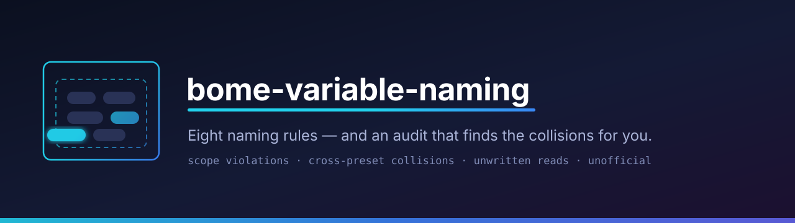

<p align="center"></p>

# bome-variable-naming

**Find the variable collisions in a Bome MIDI Translator Pro project — and a naming
convention that makes them impossible by construction.**

```console
$ python3 audit.py "Akai_LPD8_Lightshow.bmtp"
Akai_LPD8_Lightshow.bmtp — 1 presets, 1 active

== scope ==
  UNDOCUMENTED  cu
  global        g0 g1 g2
  local         pp
  (UNDOCUMENTED = neither one of the nine locals nor a g/h/i/j/k/l/m/n/y/z global)

== de-facto globals: read in a preset that never writes them ==
  Preset.0    ACTIVE New Preset                   reads cu

== early exits that fire the outgoing action ==
  Preset.0    ACTIVE Options2   'if(pp!=40)execute' fires before g0/g1 is assigned
```

*(abridged — the run also reports collisions, never-written variables, and outgoing
actions with a variable in the controller-number slot)*

## What it's for

Bome gives you two-character variable names and almost no guard rails: `ma`, `oo`, `pp`,
`sg` carry no scope, no type and no owner, and **only nine names are actually local** —
everything else is global, including the ones that look local. On a live rig with a dozen
presets, two translators quietly write the same box and you get a bug nobody attributes to
a naming problem: a controller *number* computed from a velocity lands in the 120–127
range and starts sending All Sound Off to every instrument downstream.

## Run the audit

```bash
python3 audit.py "MyProject.bmtp"
```

Python 3, no dependencies. `.bmtp` files are plain text and the script **only reads** —
but back your project up before changing anything, and reload it in MIDI Translator
afterwards: the app holds the project in memory and will overwrite your file when it next
saves.

It reports every variable classified as local / global / **outside both ranges**;
variables written by more than one active preset (the actual collisions); variables read
in a preset that never writes them; variables read but never written anywhere; Outgoing
Actions with a variable in the controller-number slot; and rule chains whose early
`execute` precedes the assignment it depends on.

## The convention

Eight rules, the shortest of which is the one that matters most: **`pp qq rr ss tt uu vv
ww xx` are local, every other name is global** — that is the language, not a choice. The
rest decide which to reach for, give each of the nine a fixed job, hand every global head
letter to exactly one device, and put the legend where Bome will show it back to you.

→ **[docs/convention.md](docs/convention.md)** — the eight rules, with what Bome actually
guarantees about scope.
→ **[docs/worked-example.md](docs/worked-example.md)** — one wind-controller translator,
before and after: three defects that compound into a silent rig, and the four-line fix.
`audit.py` flags the "before" on three of its checks and the "after" on none.

## Who wrote this, and who did not

**I am not affiliated with Bome.** This is not official guidance, it has not been reviewed
or endorsed by them, and "Bome" and "MIDI Translator" are their names — used here only to
say what this document is about.

I am one user writing down what an evening of debugging taught me about my own project. I
used an AI assistant to help read the file format, test the hypotheses against a MIDI
capture and draft this text; the reasoning and the wording had a lot of machine help,
while the rig, the bug and the decisions are mine. That cuts both ways: it made the
analysis possible in a few hours, and it means you should read the scope details as a
careful reading rather than a specification.

## Status

Proposal, not gospel, and not official. The scope ranges are assembled from the manual and
from forum threads, not from Bome — if you know them to be wrong or incomplete, an issue
correcting them is worth more to me than a star. The same goes for the convention itself:
it solved one rig's problem, which is not the same as being right for yours.

## Sources

* [Bome MIDI Translator Pro — user manual](https://download.bome.com/manuals/miditranslator_manual.pdf)
* [What can I do with the variables? (pp, g2, hn, etc…)](https://www.bome.com/forums/3/11876/what-can-i-do-with-the-variables-pp-g2-hn-etc/)
* [Global Variable Reference](https://www.bome.com/forums/3/12092/global-variable-reference/)
* [Initializing global variables](https://forum.bome.com/t/initializing-global-variables/1266)
* [Global variables](https://forum.bome.com/t/global-variables/1600)
* [I ran out of global variables](https://www.bome.com/forums/3/5193/i-ran-out-of-global-variables/)

## License

0BSD — do what you like with it.
